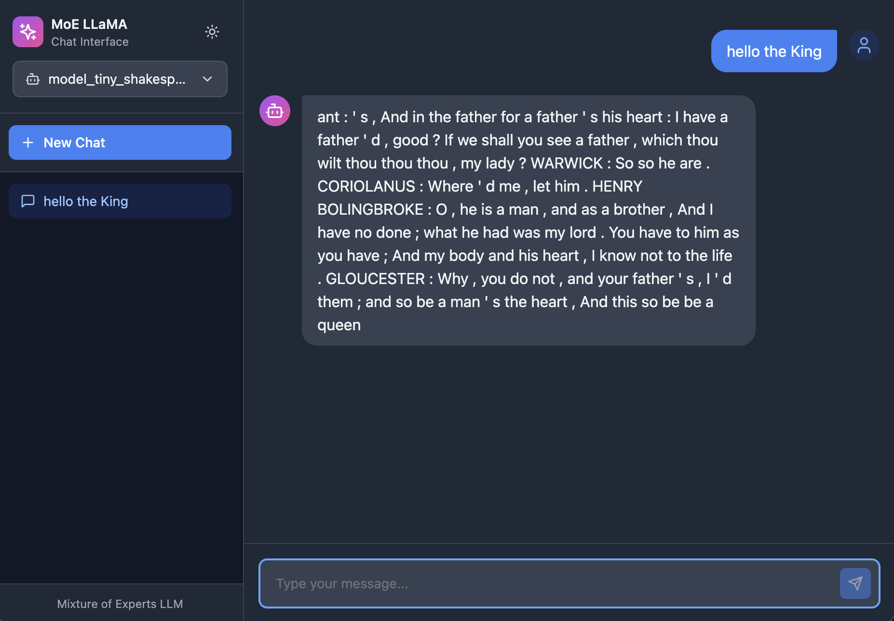

# 🌟 moellama: Mixture of Experts Language Model

<div align="center">
  
</div>

A clean, modular, educational implementation of the **Mixture of Experts (MoE)** architecture. This project provides a full-stack implementation of MoE from scratch, designed for learning and experimentation.

## 🛠️ Installation

### Prerequisites
- Python 3.10+
- pip or conda (or uv for faster installs)
- For GPU: CUDA-compatible NVIDIA GPU, or Apple Silicon for MPS, or just CPU

### Step-by-Step Setup

1. **Clone the repository**
```bash
git clone https://github.com/deepsaia/moe_llama.git
cd moe_llama
```

2. **Create virtual environment**
```bash
uv venv
```

3. **Install dependencies**
```bash
# Core dependencies (includes multi-dataset support)
uv sync
source .venv/bin/activate

# Optional: PEFT for LoRA/QLoRA fine-tuning
uv add --group peft peft bitsandbytes
```

**What's included:**
- Core training and inference
- Multi-dataset mixing
- Streaming for large datasets
- Multi-stage training pipeline
- Optional: PEFT/LoRA for efficient fine-tuning

---

## 🚀 Usage

### Training a Model

#### Single-Dataset Training (Classic)

Train a new model from scratch on a single dataset:

```bash
python -m scripts.train
```

With custom configuration:

```bash
python -m scripts.train --config config/custom_config.hocon
```

The training script will:
1. Download the dataset (Tiny Shakespeare by default to `dataset/`)
2. Train the BPE tokenizer on your dataset
3. Create and train the MoE model
4. Save checkpoints periodically
5. Generate sample text to verify the model
6. Create training history plots

**Training logs** are saved to `logs/moellama_YYYY-MM-DD.log` with:
- Color-coded console output (INFO, WARNING, ERROR, DEBUG)
- Daily rotation with 7-day retention and ZIP compression
- Detailed tracebacks for debugging
- Configuration in `config/logging.json`

#### Multi-Dataset Training (NEW)

Train on multiple datasets simultaneously with custom ratios:

```bash
# Simple multi-dataset with equal ratios
python -m scripts.train --config config_multi_simple.hocon

# Large-scale with streaming (100B+ tokens)
python -m scripts.train --config config_multi_large.hocon
```

**Example config** (`config_multi_simple.hocon`):
```hocon
training {
  dataset_mixture = [
    {
      name = "tiny_shakespeare"
      ratio = 0.6              # 60% from Shakespeare
    }
    {
      name = "Salesforce/wikitext"
      subset = "wikitext-2-v1"
      ratio = 0.4              # 40% from WikiText
      percentage = 0.5         # Use only 50% of dataset
    }
  ]
  batch_size = 16
  epochs = 3
}
```

**Features:**
- Mix multiple datasets with custom ratios
- Percentage sampling (use 10% of a 100B token dataset)
- Streaming support for memory-efficient training on massive datasets
- Domain filtering for datasets like FineFineWeb
- 100% backward compatible with existing configs

#### Multi-Stage Training Pipeline (NEW)

Run complete training pipeline: Base → Midtraining → Fine-Tuning:

```bash
python -m scripts.train_multistage --config config_multistage.hocon
```

**Three-stage pipeline:**
1. **Base Training** - Pretrain from scratch on large corpus
2. **Midtraining** - Adapt to conversational/task-specific data
3. **SFT (Supervised Fine-Tuning)** - Fine-tune with PEFT/LoRA

**Example config** (`config_multistage.hocon`):
```hocon
training {
  multi_stage = true

  # Stage 1: Base pretraining
  base_stage = {
    enabled = true
    dataset_mixture = [...]
    epochs = 3
    save_checkpoint = true
  }

  # Stage 2: Midtraining
  mid_stage = {
    enabled = true
    load_checkpoint = "base_model"
    learning_rate = 1e-4  # Lower LR
  }

  # Stage 3: Fine-tuning with LoRA
  sft_stage = {
    enabled = true
    method = "lora"  # Options: "full", "lora", "qlora"
    peft = {
      lora_r = 8
      lora_alpha = 16
    }
  }
}
```

**Benefits:**
- Efficient fine-tuning with LoRA/QLoRA
- Automatic checkpoint management between stages
- Flexible stage configuration (enable/disable stages)
- Memory-efficient training with PEFT

See the [Migration Guide](docs/migration_guide.md) for detailed upgrade instructions.

### Batch Inference

Generate text from prompts:

```bash
# Single prompt
python -m scripts.inference --prompt "The future of AI is"

# Multiple prompts from file
python -m scripts.inference --prompts-file prompts.txt

# Custom parameters
python -m scripts.inference \
  --prompt "Once upon a time" \
  --max-tokens 100 \
  --temperature 0.9 \
  --top-k 40 \
  --top-p 0.95
```

### Interactive Chat

**Terminal Interface:**

```bash
python -m scripts.interactive

# With verbose statistics
python -m scripts.interactive --verbose
```

**Interactive commands:**
- Type your prompt and press Enter to generate
- Type `params` to adjust generation parameters
- Type `exit` or `quit` to quit
- Press Ctrl+C to interrupt generation

**Web Interface:**

Launch the modern web-based chat UI with streaming responses and thread management. Built with **React**, **@assistant-ui/react**, **Tailwind CSS**, and **FastAPI**.

**First Time Setup:**
```bash
# Install frontend dependencies (using yarn)
cd frontend
yarn install

# Build the frontend
yarn build

# Return to project root
cd ..
```

Or use the build script from project root:
```bash
bash scripts/build_frontend.sh
```

This builds the React app to `prebuilt_frontend/dist/` which the FastAPI server will serve.

**Start the Server:**
```bash
# Start the chat server
python -m scripts.chat_server

# Open browser to http://localhost:8000
```
<div align="center">
  
</div>


**Features:**
- 🌊 **Streaming responses** - Real-time text generation with Server-Sent Events
- 💬 **Thread management** - Create, switch between, and manage multiple conversation threads
- 🔄 **Model selection** - Switch between trained checkpoints on the fly
- 💾 **Message persistence** - All conversations saved to localStorage for later access
- 🌓 **Dark/Light theme** - Toggle between themes with smooth transitions
- 🎨 **Modern UI** - Clean, responsive interface built with Tailwind CSS and @assistant-ui/react primitives
- ⚙️ **Generation controls** - Adjust temperature, max tokens, top-k, top-p
- 📝 **Full message history** - View complete conversation history when switching threads
- 🗑️ **Thread deletion** - Remove unwanted conversations
- 🚀 **FastAPI backend** - Production-ready async API with streaming support
- 📱 **Responsive design** - Works seamlessly on desktop and mobile

**Development Mode:**

For frontend development with hot reload:
```bash
# Terminal 1: Start backend in dev mode
python -m scripts.chat_server --dev-mode

# Terminal 2: Start frontend dev server
cd frontend
yarn dev
# Opens at http://localhost:5173
```

**Custom Server Options:**
```bash
# Custom port
python -m scripts.chat_server --port 8080

# Bind to all interfaces (remote access)
python -m scripts.chat_server --host 0.0.0.0
```

📖 **Complete guides:**
- [docs/chat_ui.md](docs/chat_ui.md) - Backend API documentation, deployment
- [frontend/README.md](frontend/README.md) - Frontend development, customization

---

**Sample Interaction** with a model trained on tiny_shakespeare dataset:

```markdown
Prompt: what say you

Generating...

================================================================================
Generated Text:
--------------------------------------------------------------------------------
what say you at : I shall be the night . QUEEN MARGARET : O , the duke , I have be no too . You ' s a man , we have I have thee . LADY LADY CAPULET : The father , I , I speak , my son . Second First Murderer : O , he shall I have your blood : What have not ' s a a man ' d to me , That have been the time . LUCIO : O , this . DUKE VINCENTIO : I I am this . I ' s the heart ! DUKE VINCENTIO : Ay , my brother , let me , let you am have the other s life : I ' Tis ' s , I will be be your body . HENRY BOLINGBROKE : Why , so ? O , they ' ll see ' s with me . Why , and me , and I have been it will ; And so I think thou do my good your queen : And that you I know with a a man : And not , and a son ' d , let : I I am not
--------------------------------------------------------------------------------

Stats: 204 tokens, 27.13 tokens/sec
================================================================================

Prompt: exit
Goodbye!
```

Hooray! the response looks as good as the model is and as good as the data it's trained upon.

---

## ✨ Key Features

### Core Architecture
- **Modular Architecture** - Clean separation of concerns with distinct modules
- **Mixture of Experts** - Sparse expert activation for efficient scaling
- **Rotary Positional Embeddings (RoPE)** - Better positional understanding
- **RMS Normalization** - Stable training without mean centering
- **Load Balancing** - Prevents expert collapse during training
- **Shared Expert Option** - Ensures certain knowledge is always available

### Training & Data (NEW)
- **Multi-Dataset Mixing** - Train on multiple datasets simultaneously with custom ratios
- **Streaming Support** - Memory-efficient training on 100B+ token datasets
- **Percentage Sampling** - Use only a portion of large datasets (e.g., 10% of 100B tokens)
- **Domain Filtering** - Select specific domains from datasets like FineFineWeb
- **Multi-Stage Training** - Base → Midtraining → SFT pipeline with automatic checkpointing
- **PEFT/LoRA Support** - Efficient fine-tuning with LoRA and QLoRA
- **Backward Compatible** - Existing single-dataset configs work unchanged

### Infrastructure
- **Multi-Device Support** - Works on CPU, CUDA (NVIDIA), MPS (Apple Silicon)
- **Enhanced Logging** - Loguru with color-coded console output and daily rotation
- **Interactive Inference** - Real-time text generation with parameter tuning
- **Web Chat UI** - Modern React-based interface with streaming
- **Centralized Configuration** - HOCON config files organized in `config/` directory
- **Comprehensive Documentation** - Detailed docstrings and inline comments
- **Test Suite** - Automated tests for core functionality

## 📋 What is Mixture of Experts?

Unlike traditional transformers that route every token through the same feed-forward network, MoE models use multiple "expert" networks. A router network decides which experts should process each token, enabling:

- **Efficient Scaling** - More parameters without proportional compute cost
- **Specialization** - Different experts learn different patterns
- **Sparse Activation** - Only top-k experts process each token
- **Better Performance** - Match dense models with less computation

**Example**: With 8 experts and `top_k=2`, each token is processed by only 2 experts, but different tokens may select different experts based on their content.

## 📁 Project Structure

### Module Overview

#### Core Model Components

- **`model.py`** - The complete LLaMA4MoE model
  - Token embeddings
  - Transformer blocks with MoE
  - Language modeling head
  - Generation with sampling strategies

- **`moe.py`** - Mixture of Experts implementation
  - `Expert`: Individual feed-forward networks
  - `Router`: Selects which experts to activate
  - `MoELayer`: Combines routing and expert processing

- **`attention.py`** - Multi-head self-attention
  - Query, Key, Value projections
  - Causal masking for autoregressive generation
  - Optional rotary positional embeddings

- **`layers.py`** - Fundamental building blocks
  - `RMSNorm`: Root Mean Square normalization
  - `RotaryPositionalEmbeddings`: RoPE implementation
  - `TransformerBlock`: Attention + MoE with residual connections

#### Training Infrastructure

- **`trainer.py`** - Training infrastructure
  - Mixed precision training (AMP)
  - Multi-GPU support (DataParallel)
  - Gradient clipping and optimization
  - Checkpointing and evaluation

- **`dataset.py`** - Data utilities
  - `TextDataset`: Tokenized sequences
  - `prepare_dataset`: Download and prepare data
  - Support for single and multi-dataset modes
  - Backward compatibility with classic configs

- **`dataset_manager.py`** (NEW) - Multi-dataset orchestration
  - `DatasetConfig`: Configuration dataclass for datasets
  - `DatasetManager`: Load and mix multiple datasets
  - Ratio-based mixing with HuggingFace interleave_datasets
  - Percentage sampling and domain filtering
  - Robust error handling and validation

- **`streaming_dataloader.py`** (NEW) - Efficient streaming
  - `StreamingDataLoader`: Token buffer for constant memory usage
  - Handles 100B+ token datasets efficiently
  - Compatible with HuggingFace IterableDataset
  - DDP-aware for distributed training

- **`tokenizer.py`** - BPE tokenization
  - Training BPE from text
  - Encoding/decoding
  - Special token handling

#### Multi-Stage Training (NEW)

- **`stages/base_train.py`** - Base pretraining stage
  - Full model training from scratch
  - Multi-dataset support
  - Checkpoint saving

- **`stages/mid_train.py`** - Midtraining stage
  - Loads base model checkpoint
  - Adapts to conversational/task data
  - Lower learning rate

- **`stages/sft_train.py`** - Supervised fine-tuning stage
  - Full fine-tuning or PEFT/LoRA
  - Very low learning rate
  - Adapter merging support

- **`stages/pipeline.py`** - Pipeline orchestration
  - `MultiStageTrainingPipeline`: Orchestrates all stages
  - Automatic checkpoint management
  - Flexible stage enable/disable

- **`peft_utils.py`** (NEW) - PEFT integration
  - `PEFTManager`: Manages LoRA/QLoRA adapters
  - `create_peft_manager`: Factory function
  - Supports adapter merging and saving
  - Graceful fallback if PEFT not installed

#### Utilities & Evaluation

- **`utils.py`** - Helper functions
  - Configuration loading (HOCON)
  - Device setup (CPU/CUDA/MPS)
  - Model inspection utilities
  - Multi-dataset config logging

- **`benchmarks.py`** - Evaluation suite
  - Perplexity and accuracy metrics
  - Generation quality tests
  - Counting and math benchmarks
  - Framework for standard benchmarks (ARC, MMLU, etc.)

- **`report.py`** - Report generation
  - Markdown report formatting
  - Model and training information
  - Benchmark visualization
  - Customizable sections

#### Scripts

- **`scripts/train.py`** - Single or multi-dataset training
- **`scripts/train_multistage.py`** (NEW) - Multi-stage pipeline
- **`scripts/inference.py`** - Batch text generation
- **`scripts/interactive.py`** - Terminal chat interface
- **`scripts/chat_server.py`** - Web chat server (FastAPI)
- **`scripts/evaluate.py`** - Model evaluation and reporting

## ⚙️ Configuration

Configuration is managed through HOCON files in the `config/` directory (Human-Optimized Config Object Notation):

```hocon
{
  # Model architecture
  model {
    dim = 256              # Model dimension
    num_layers = 4         # Transformer layers
    num_heads = 8          # Attention heads
    num_experts = 8        # Number of experts
    top_k = 2              # Experts activated per token
    max_seq_len = 256      # Maximum sequence length
    dropout = 0.1          # Dropout rate
    shared_expert = true   # Include shared expert
    load_balancing_loss_coef = 0.01  # Load balancing weight
  }

  # Device configuration
  device {
    type = "auto"          # "auto", "cpu", "cuda", "mps"
    num_cpu_threads = -1   # -1 = use all but 2 cores
    gpu_ids = [0]          # GPUs for DataParallel
    use_mps = false        # Use Apple Metal
  }

  # Training configuration
  training {
    batch_size = 16
    learning_rate = 3e-4
    epochs = 3
    eval_steps = 100
    dataset = "tiny_shakespeare"
    seq_len = 256
    num_workers = 4
  }

  # Inference configuration
  inference {
    max_new_tokens = 200
    temperature = 0.8
    top_k = 50
    top_p = 0.95
  }

  # Paths
  paths {
    model_path = "./trained_models"
    output_dir = "./model"
  }
}
```

## 📊 Working with Datasets

### Single-Dataset Training (Classic)

#### Default Dataset: Tiny Shakespeare

The default configuration uses **Tiny Shakespeare** (~1MB), which automatically downloads to `dataset/`:

```bash
python -m scripts.train  # Downloads and caches to dataset/tiny_shakespeare/
```

#### Using HuggingFace Datasets

Use any text dataset from HuggingFace by editing `config/config.hocon`:

```hocon
training {
  dataset = "wikitext"     # Change to any HF dataset
  data_dir = "dataset"     # Cached here (gitignored)
  ...
}
```

**Popular Options:**
- `tiny_shakespeare` - 1MB, Shakespeare (default)
- `wikitext` - 500MB, Wikipedia articles
- `openwebtext` - 38GB, web pages from Reddit
- `bookcorpus` - 5GB, books
- Browse more: https://huggingface.co/datasets?task_categories=text-generation

### Multi-Dataset Training (NEW)

Train on multiple datasets with custom ratios and advanced features.

#### Configuration Formats

**Format 1: Simple list (equal ratios)**
```hocon
training {
  datasets = ["tiny_shakespeare", "wikitext"]  # 50/50 split
}
```

**Format 2: Custom ratios with full control**
```hocon
training {
  dataset_mixture = [
    {
      name = "tiny_shakespeare"
      ratio = 0.6              # 60% from this dataset
      split = "train"
    }
    {
      name = "Salesforce/wikitext"
      subset = "wikitext-2-v1" # Specific subset
      ratio = 0.4              # 40% from this dataset
      percentage = 0.5         # Use only 50% of dataset
      streaming = false        # Map-style loading
    }
  ]
  stopping_strategy = "all_exhausted"  # or "first_exhausted"
}
```

#### Advanced Features

**Percentage Sampling** - Use only a portion of large datasets:
```hocon
{
  name = "karpathy/fineweb-edu-100b-shuffle"
  percentage = 0.10          # Use 10% = 10B tokens
}
```

**Streaming for Large Datasets** - Memory-efficient loading:
```hocon
{
  name = "karpathy/fineweb-edu-100b-shuffle"
  streaming = true           # Constant memory usage
  percentage = 0.10
}
```

**Domain Filtering** - Select specific domains:
```hocon
{
  name = "m-a-p/FineFineWeb"
  domains = ["aerospace", "biology", "mathematics"]
  streaming = true
}
```

#### Popular Large-Scale Datasets

- **FineWeb-Edu** (100B+ tokens) - High-quality educational web text
  - `karpathy/fineweb-edu-100b-shuffle` - Shuffled version
- **FineFineWeb** - Domain-specific filtered web text
  - `m-a-p/FineFineWeb` - Supports domain filtering
- **The Pile** - Diverse training corpus (800GB)
  - Various subsets available
- **C4** - Colossal Clean Crawled Corpus
  - `allenai/c4` - 300GB+ of clean web text
- **RedPajama** - Open reproduction of LLaMA training data
  - `togethercomputer/RedPajama-Data-1T` - 1T tokens

**Tip**: Always use `streaming = true` for datasets over 10GB to avoid memory issues.

### Using Custom Datasets

**Quick Start** - Place your text files in `dataset/`:

```bash
mkdir -p dataset/my_data
echo "Your training text..." > dataset/my_data/data.txt
```

Then use in multi-dataset config:
```hocon
training {
  dataset_mixture = [
    {
      name = "local"
      path = "./dataset/my_data/data.txt"
      ratio = 0.3
      format = "text"  # or "jsonl"
    }
    {
      name = "tiny_shakespeare"
      ratio = 0.7
    }
  ]
}
```

**Supported formats:**
- `.txt` - Plain text files
- `.jsonl` - JSON lines with "text" field

**Complete Guide**: See [DATASETS.md](DATASETS.md) for:
- Loading custom text files
- Using JSON/JSONL data
- Processing multiple files
- Preprocessing and augmentation
- Memory management for large datasets

### Dataset Directory Structure

```
dataset/                    # All datasets (gitignored)
├── tiny_shakespeare/       # Default dataset
├── wikitext/              # HuggingFace datasets
├── fineweb-edu/           # Large streaming datasets (cached)
└── my_custom_data/        # Your custom data
```

---

## 📈 Model Evaluation & Benchmarking

Evaluate your trained model with comprehensive benchmarks and generate a detailed report.

### Running Evaluation

```bash
# Evaluate the latest trained model
python -m scripts.evaluate

# Evaluate a specific checkpoint
python -m scripts.evaluate --model-file path/to/model.pt

# Custom output location
python -m scripts.evaluate --output my_report.md
```

### Available Benchmarks

The evaluation suite includes comprehensive standard LLM benchmarks:

**Standard LLM Benchmarks (Implemented):**
- **ARC-Easy** - AI2 Reasoning Challenge (Easy questions)
- **ARC-Challenge** - AI2 Reasoning Challenge (Challenge questions)
- **MMLU** - Massive Multitask Language Understanding (57 subjects)
- **GSM8K** - Grade School Math reasoning
- **HellaSwag** - Commonsense reasoning via scenario completion
- **WinoGrande** - Pronoun resolution / coreference

**Training-Time Benchmarks:**
- Quick evaluation at end of each epoch (100 samples per benchmark)
- Final comprehensive evaluation with all samples at end of training
- Results logged to TensorBoard and WandB (optional)
- Benchmark reports saved to `report/bm_report_<modelname>_<datetime>.md`

**Standalone Benchmark Runner:**
```bash
# Full evaluation
python -m scripts.run_benchmarks --model-path ./model/model_*.pt

# Quick evaluation (100 samples)
python -m scripts.run_benchmarks --model-path ./model/model_*.pt --quick
```

### Configuration

Control evaluation via `config/config.hocon`:

```hocon
evaluation {
  enabled = true  # Enable/disable evaluation

  # Select which benchmarks to run
  enabled_benchmarks = [
    "perplexity",
    "accuracy",
    "generation",
    "counting",
    "simple_math"
  ]

  # Custom test prompts for generation
  test_prompts = [
    "Once upon a time",
    "The future of AI is",
    "In a distant land"
  ]

  # Report output location
  report_path = "report.md"
}
```

### Generated Report

The evaluation generates a markdown report including:

- **Model Architecture** - Parameter counts, configuration
- **Training Details** - Dataset, hyperparameters, optimizer
- **Benchmark Results** - Detailed scores with explanations
- **Generation Samples** - Example outputs from the model
- **Summary Table** - Quick overview of all metrics

**Example report structure:**
```
# Model Evaluation Report

## Model Architecture
| Component | Value |
|-----------|-------|
| Model Type | Mixture of Experts |
| Total Parameters | 2.5M |
...

## Summary
| Metric | Score |
|--------|-------|
| Perplexity | 45.2 |
| Token Accuracy | 32.5% |
...

## Generation Samples
...
```

### Programmatic Usage

You can also run evaluations programmatically:

```python
from moellama import run_benchmarks, generate_report

# Run benchmarks
results = run_benchmarks(model, tokenizer, device, config, eval_dataset)

# Generate report
generate_report(model, config, results, output_path="report.md")
```

### Adding Custom Benchmarks

To add your own benchmark:

1. Add a method to `BenchmarkSuite` in `moellama/benchmarks.py`
2. Add the benchmark name to `enabled_benchmarks` in config
3. Update report generation if needed

See [moellama/benchmarks.py](moellama/benchmarks.py) for examples.

---

## 📊 Model Architecture Details

### Transformer Block

Each transformer block consists of:

```
Input
  ↓
RMSNorm → Multi-Head Attention (with RoPE) → Add & Norm
  ↓
RMSNorm → Mixture of Experts → Add & Norm
  ↓
Output
```

### Mixture of Experts Layer

```
Input tokens
  ↓
Router (learns which experts to use)
  ↓
Top-k Expert Selection
  ↓
Expert 1    Expert 2    ...    Expert N    [Shared Expert]
  ↓           ↓                    ↓              ↓
Weighted combination of expert outputs
  ↓
Output
```

**Key mechanisms:**
- **Router**: Linear layer + softmax to select experts
- **Load Balancing Loss**: Encourages even expert usage
- **Noise during training**: Prevents expert collapse
- **Shared Expert**: Optional expert that always processes all tokens

### Attention Mechanism

Multi-head attention with:
- **RoPE (Rotary Position Embeddings)**: Encodes position into Q and K
- **Causal Masking**: Prevents attending to future tokens
- **Multi-head**: Parallel attention with different learned projections

## 🔍 Understanding the Code

### Training Flow

1. **Configuration** - Load from `config/config.hocon`
2. **Device Setup** - Detect and configure compute device
3. **Data Preparation** - Download, tokenize, create datasets
4. **Model Creation** - Initialize LLaMA4MoE with config parameters
5. **Training Loop**:
   - Forward pass through model
   - Compute loss (cross-entropy + load balancing)
   - Backward pass and optimization
   - Periodic evaluation and checkpointing
6. **Saving** - Save final model and tokenizer

### Generation Flow

1. **Load Model** - Load checkpoint and tokenizer
2. **Encode Prompt** - Convert text to token IDs
3. **Autoregressive Generation**:
   - Feed tokens through model
   - Get logits for next token
   - Apply sampling (temperature, top-k, top-p)
   - Sample next token
   - Append and repeat
4. **Decode** - Convert token IDs back to text

## 🐞 Troubleshooting

### Common Issues

**Vocabulary Size Mismatch**
```
size mismatch for token_embeddings.weight
```
**Solution**: Use the same vocab file from training for inference.

**Out of Memory (OOM)**
```
RuntimeError: CUDA out of memory
```
**Solution**: Reduce `batch_size` in `config/config.hocon`

**Import Errors**
```
ModuleNotFoundError: No module named 'moellama'
```
**Solution**: Run scripts as modules: `python -m scripts.train`

**Slow CPU Training**
**Solution**:
- Set `num_cpu_threads = -1` in config to use more cores
- Consider using a GPU or reducing model size

### Multi-Dataset Issues (NEW)

**"No configuration setting found for key dataset"**
```
pyhocon.exceptions.ConfigMissingException: No configuration setting found for key dataset
```
**Solution**: This error was fixed in the latest version. Update your code or ensure you're using `dataset_mixture` or `datasets` instead of `dataset` in multi-dataset mode.

**"datasets library not found"**
```
ImportError: HuggingFace datasets library not found
```
**Solution**: Install the datasets library:
```bash
pip install datasets
# or
uv add datasets
```

**Out of Memory with Large Datasets**
**Solution**: Enable streaming mode:
```hocon
{
  name = "large-dataset"
  streaming = true      # Add this!
  percentage = 0.1      # Use smaller percentage
}
```

**Dataset Loading Fails**
```
Failed to load dataset 'dataset_name'
```
**Solution**: Check:
1. Dataset name is correct (check HuggingFace hub)
2. Network connection is working
3. Dataset is publicly available
4. If using local dataset, path exists

**Ratios Don't Sum to 1.0**
**Solution**: Don't worry! Ratios are automatically normalized. This is perfectly fine:
```hocon
dataset_mixture = [
  { name = "ds1", ratio = 3 }  # Will become 3/5 = 0.6
  { name = "ds2", ratio = 2 }  # Will become 2/5 = 0.4
]
```

### Multi-Stage Issues (NEW)

**"PEFT library not found"**
```
ImportError: PEFT library not found
```
**Solution**: Install PEFT (only needed for LoRA):
```bash
pip install peft bitsandbytes
# or
uv add --group peft peft bitsandbytes
```

**Checkpoint Not Found in Multi-Stage**
```
FileNotFoundError: Checkpoint 'base_model' not found
```
**Solution**: Ensure previous stage ran successfully and saved checkpoint:
```hocon
base_stage = {
  enabled = true
  save_checkpoint = true
  checkpoint_name = "base_model"
}

mid_stage = {
  enabled = true
  load_checkpoint = "base_model"  # Must match checkpoint_name above
}
```

### Performance Tips

- **GPU**: Use CUDA for 10-100x speedup
- **Mixed Precision**: Automatically enabled on CUDA (AMP)
- **Batch Size**: Increase if you have memory
- **Multi-GPU**: Set `use_data_parallel = true` and `gpu_ids = [0, 1, ...]`
- **CPU Threads**: Set `num_cpu_threads = -1` to use all but 2 cores
- **Large Datasets**: Always use `streaming = true` for datasets over 10GB
- **Memory Optimization**: Use LoRA instead of full fine-tuning to save memory

## 📈 Example Results

After training on Tiny Shakespeare:

```
Prompt: To be or not to be
Generated: To be or not to be,
That is the question that makes me wonder,
Whether 'tis nobler in the mind to suffer
The slings and arrows of outrageous fortune...

Stats: 45 tokens, 8.2 tokens/sec
```

## 📚 Documentation

### Core Documentation

- **[README.md](README.md)** (this file) - Overview, installation, usage
- **[DATASETS.md](DATASETS.md)** - Working with datasets (single and multi-dataset)
- **[Migration Guide](docs/migration_guide.md)** - Upgrade guide from single to multi-dataset training

### Technical Documentation (NEW)

- **[Dataset Pipeline Design](docs/dataset_pipeline_design.md)** - Complete technical design of multi-dataset system
  - Architecture overview
  - Streaming vs map-style datasets
  - Multi-stage training design
  - PEFT integration design

- **[Implementation Progress](docs/implementation_progress.md)** - Development tracking
  - Feature completion status
  - Testing progress
  - Known issues and TODOs

### Example Configurations (NEW)

- **`config/config.hocon`** - Default single-dataset configuration
- **`config/config_multi_simple.hocon`** - Simple multi-dataset with custom ratios
- **`config/config_multi_large.hocon`** - Large-scale streaming (100B+ tokens)
- **`config/config_multistage.hocon`** - Complete multi-stage pipeline with LoRA
- **`config/logging.json`** - Loguru logging configuration

### Quick Start Guides

1. **Beginner**: Use default config → `python -m scripts.train`
2. **Intermediate**: Try multi-dataset → `python -m scripts.train --config config_multi_simple.hocon`
3. **Advanced**: Large-scale streaming → Use `config_multi_large.hocon` with your datasets
4. **Expert**: Multi-stage pipeline → `python -m scripts.train_multistage --config config_multistage.hocon`

## 🤝 Contributing

Contributions are welcome! This project focuses on:
- **Clarity** - Code should be easy to understand
- **Modularity** - Components should be independent
- **Documentation** - Every function should have clear docstrings
- **Educational Value** - Prioritize learning over performance

**Areas for Contribution:**
- Additional benchmarks and evaluation metrics
- Support for more dataset formats
- Documentation improvements
- Performance optimizations
- Bug fixes and testing

## 📚 References

- [Attention Is All You Need](https://arxiv.org/abs/1706.03762) - Original Transformer
- [RoFormer](https://arxiv.org/abs/2104.09864) - Rotary Position Embeddings
- [RMSNorm](https://arxiv.org/abs/1910.07467) - Root Mean Square Normalization
- [Switch Transformers](https://arxiv.org/abs/2101.03961) - Sparse MoE at scale
- [GShard](https://arxiv.org/abs/2006.16668) - Scaling with MoE
- [LLaMA](https://arxiv.org/abs/2302.13971) - Efficient large language models
- [nanochat](https://github.com/karpathy/nanochat) - Karpathy's full-stack implementation of an LLM like ChatGPT

## 📄 License

This project is licensed under the Apache 2.0 License - see the [LICENSE](LICENSE) file for details.

## 🙏 Acknowledgments

- Built for educational purposes to understand MoE architectures
- Thanks to the PyTorch and HuggingFace communities
- Multi-dataset and streaming design inspired by production-grade training pipelines

---

## 🎉 What's New in v0.2.0

### Multi-Dataset Training
✅ Train on multiple datasets simultaneously with custom ratios
✅ Percentage sampling (use 10% of a 100B token dataset)
✅ Streaming support for memory-efficient training on massive datasets
✅ Domain filtering for datasets like FineFineWeb
✅ Three config formats: single dataset, simple list, or full mixture
✅ 100% backward compatible with existing configs

### Multi-Stage Training Pipeline
✅ Base → Midtraining → SFT pipeline with automatic orchestration
✅ Automatic checkpoint management between stages
✅ Flexible stage enable/disable configuration
✅ Lower learning rates at each stage for better convergence

### PEFT/LoRA Support
✅ Efficient fine-tuning with LoRA and QLoRA
✅ Adapter merging and saving
✅ Graceful fallback if PEFT not installed
✅ Memory-efficient training for large models

### Infrastructure Improvements
✅ **Enhanced Logging with Loguru** - Color-coded console output, daily rotation with 7-day retention
✅ **Centralized Configuration** - All config files organized in `config/` directory
✅ Robust error handling and validation throughout pipeline
✅ Comprehensive logging with dataset info
✅ DDP-aware streaming data loader
✅ Token buffer approach for constant memory usage
✅ Enhanced test suite with pytest
✅ Extensive documentation and migration guide

### Example Configurations
✅ `config_multi_simple.hocon` - Multi-dataset with custom ratios
✅ `config_multi_large.hocon` - Large-scale streaming (100B+ tokens)
✅ `config_multistage.hocon` - Complete pipeline with LoRA

**Upgrade Guide**: See [Migration Guide](docs/migration_guide.md) for detailed instructions.

---

> "The future of AI isn't about replacing humans, but about creating tools that enhance our capabilities while respecting our values." - moellama Team

**Happy Learning! 🚀**
